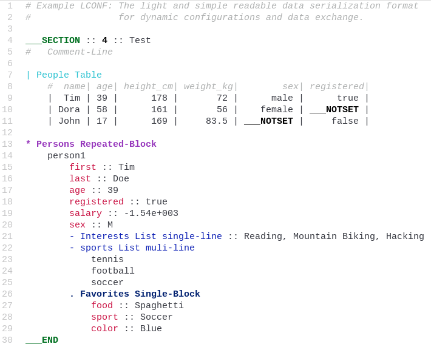

## atom-theme-p-light-syntax

*atom-theme-p-light-syntax* is an [Atom-Editor](https://atom.io/) Syntax Theme package a derivative of Atom's [One
Light Syntax Theme](https://github.com/atom/one-light-syntax).

### Features

*   Additional Syntax highlighting for a number of languages:

    *   [LCONF](http://lconf.github.io/) The light and simple readable data serialization format for dynamic
        configurations and data exchange.

### Installation

Installation happens normally either through `apm install atom-theme-p-light-syntax` or through the install section of
the settings tab within Atom.

### Recommended Extras

*   The [atom-language-lconf](http://lconf.github.io/atom-language-lconf/) package provides LCONF language support in
    Atom Editor.
*   The [atom-language-julia](https://github.com/JuliaLang/atom-language-julia) package is a Julia language support
    package for the Atom editor.

*   [Atom Light UI Theme](https://github.com/atom/atom-light-ui) package is the recommendet companion UI Theme.

### Recommended Atom Settings

*   *UI Theme*: [Atom Light](https://github.com/atom/atom-light-ui)
*    fontFamily: "Liberation Mono"
*    lineHeight: 1.3

### LCONF Language Example File

